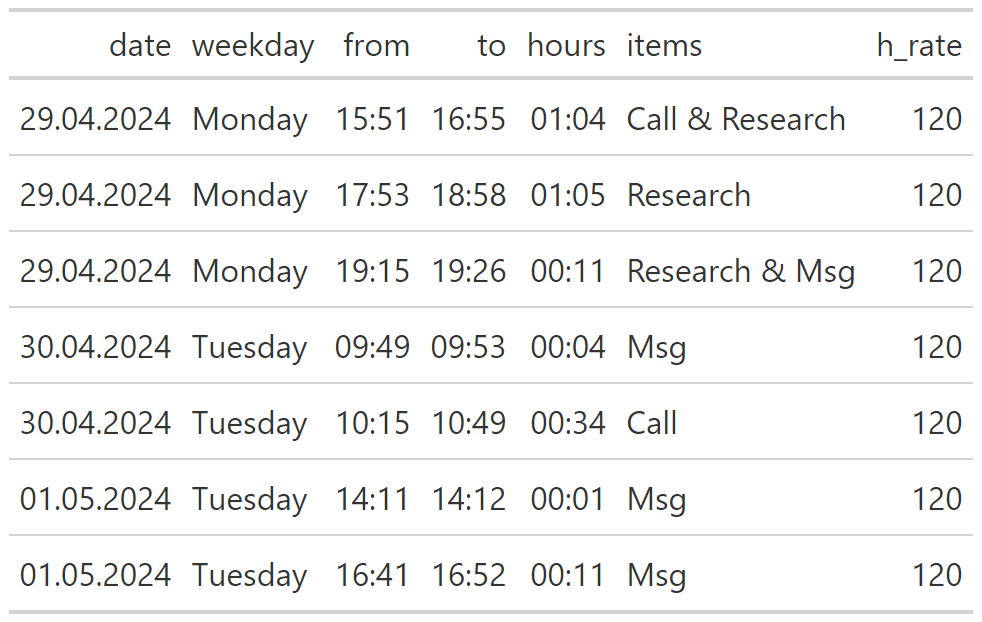

---
header-includes:
- \usepackage{setspace}
- \usepackage{float}
date: "Place, `r format(Sys.time(), '%d %b %Y')`"
output:
  pdf_document:
    template: headerfootertemp.tex

---


```{=tex}
\fontsize{10}{22}
\selectfont
\raggedleft
```
**Name of Receiver**\
attention to\
address\
zip and town\
country\


   

\raggedright

**Subjectline**\
\
\
Dear Receiver\
\
Lorem ipsum dolor sit amet, consectetur adipiscing elit. Etiam tellus massa, tincidunt sed blandit in, congue et elit. Suspendisse dui est, faucibus id lacus at, gravida porta lectus. Ut in aliquam ex, vel porta ante. Duis imperdiet velit vel velit placerat, pulvinar venenatis metus tristique. Suspendisse rhoncus sem sollicitudin tortor ultrices, eu hendrerit tortor varius. Quisque viverra ac tellus eget consequat. Nam at libero in neque consequat gravida non venenatis eros. Nam interdum mollis urna at tincidunt. Maecenas fringilla nulla dui, et interdum purus mollis sit amet. Vestibulum in euismod mi, a elementum erat. Aliquam ut elit ipsum. Donec eleifend arcu ac est mollis tempor. Quisque tincidunt rutrum fringilla. Pellentesque quis ipsum fermentum, consequat eros vel, gravida nunc. Praesent iaculis nisl eget mollis eleifend. \

Here is our time report:
```{r echo=FALSE, warning=FALSE, message=FALSE, include=FALSE}
library(readr)
library(shiny)
library(dplyr)
library(gt)
library(tinytex)
library(knitr)
library(lubridate)
library(hms)

options(tinytex.verbose = TRUE)


cry <- "USD"
treport <- as.data.frame(read.csv('./timetable.csv', sep = ","))


treport%>% 
  gt() %>% 
  gtsave('treport.png')
```
  
```{r timetable, echo=FALSE, out.width = '60%'}
options(knitr.duplicate.label = "allow")


```

```{r echo=FALSE, warning=FALSE, message=FALSE}
thours <- sum(as.numeric(hm(treport$hours, quiet = T))/60)
ttemp <- thours/60
tform <- hms(hours=ttemp)

hrate <- round(treport$h_rate[1] * 20) / 20
invamount <- round(hrate * ttemp * 20)/20

```

Total hours worked are `r tform`. 

The hourly rate is `r paste0(cry,hrate)`.

The invoice amount is **`r paste0(cry,invamount)`**.
  


Kind regards\
Name of the sender
